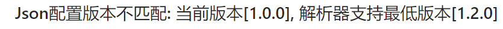

# form-parser

表单解析器实现了对Json配置的校验和解析, 同时对组件本身产生一定程度干涉

部分功能支持二次开发

## 组件参数

表单解析器支持如下参数:

<table>
  <thead>
    <tr>
      <th>名称</th>
      <th>说明</th>
      <th>类型</th>
      <th>默认值</th>
    </tr>
  </thead>
  <tbody>
    <tr>
      <td>value</td>
      <td>表单数据</td>
      <td>Object</td>
      <td>{}</td>
    </tr>
    <tr>
      <td>formId</td>
      <td>表单id</td>
      <td>String</td>
      <td>必填</td>
    </tr>
    <tr>
      <td>config</td>
      <td>Json配置</td>
      <td>Object</td>
      <td>必填</td>
    </tr>
    <tr>
      <td>extendConfigs</td>
      <td>拓展配置</td>
      <td>Array</td>
      <td>[]</td>
    </tr>
  </tbody>
</table>

## 组件数据

表单解析器可对组件产生一定程度干涉, 如生命周期/方法/事件

以下数据均可在组件实例化后进行使用, 但请务必谨慎:

<table>
  <thead>
    <tr>
      <th>名称</th>
      <th>说明</th>
      <th>类型</th>
    </tr>
  </thead>
  <tbody>
    <tr>
      <td>data</td>
      <td>表单数据</td>
      <td>Object</td>
    </tr>
    <tr>
      <td>elementConfigs</td>
      <td>表单元素配置Map, key: 表单数据属性 value: 表单元素Json配置</td>
      <td>Object</td>
    </tr>
  </tbody>
</table>

## 版本校验

在渲染表单之前, 会进行Json配置版本与解析器版本校验

如Json配置版本小于解析器当前支持的最低版本, 则无法进行初始化, 可根据提示信息调整表单设计器版本或Json配置内容

例如, 解析器当前支持最低版本为1.2.0, Json配置版本为1.0.0, 会展示如下错误信息:



## 自定义组件

理论上表单解析器支持开发者创建的自定义组件, 但有一定的约束规范:

1.自定义组件需进行全局注册
2.如需绑定业务数据, 自定义组件应支持v-model

## 方法解析

方法解析依赖于方法配置实体, 其结构如下:

```js
{
  name: 'myFunc',
  arguments: 'name,age',
  body: 'this.message = `${name}的年龄是${age}`;'
}
```

- name: 方法名称
- arguments: 方法参数, 多个参数以逗号分隔
- body: 方法体

所有方法将会绑定在表单组件实例上, 在方法内部可使用this, 即组件运行上下文

**注意: 在方法中赋值的属性非响应式**

## 默认值解析

表单解析器目前支持四种默认值方式:

<table>
  <thead>
    <tr>
      <th>类型</th>
      <th>格式</th>
      <th>说明</th>
    </tr>
  </thead>
  <tbody>
    <tr>
      <td>vuex</td>
      <td>$store.[缓存属性名称]</td>
      <td>从vuex中获取数据, 需在getters中有对应的属性</td>
    </tr>
    <tr>
      <td>当前组件数据</td>
      <td>${data[0].a.b}</td>
      <td>当前组件中的数据, 支持多层级读取</td>
    </tr>
    <tr>
      <td>接口</td>
      <td>$api.getData({ id: this.formId })</td>
      <td>通过接口获取数据, 接口内容应与后台匹配</td>
    </tr>
    <tr>
      <td>静态数据</td>
      <td>test</td>
      <td>静态数据直接赋值</td>
    </tr>
  </tbody>
</table>

**注意: 默认值解析顺序敏感, 会使用最先命中的解析器进行处理**

默认值解析支持二次开发, 详情参考[二次开发中的对应内容](/zh-cn/develop/defaultValue)

## 选项配置解析

表单解析器目前支持四种选项配置解析:

<table>
  <thead>
    <tr>
      <th>类型</th>
      <th>格式</th>
      <th>说明</th>
    </tr>
  </thead>
  <tbody>
    <tr>
      <td>静态数据</td>
      <td>test</td>
      <td>静态数据直接赋值</td>
    </tr>
    <tr>
      <td>动态数据</td>
      <td>dynamic</td>
      <td>当前组件中的数据</td>
    </tr>
    <tr>
      <td>字典</td>
      <td>dictionaryType</td>
      <td>输入字典类型, 调用字典接口获取数据内容</td>
    </tr>
    <tr>
      <td>枚举</td>
      <td>enumName</td>
      <td>输入枚举名称, 从缓存中读取数据内容</td>
    </tr>
  </tbody>
</table>

**注意: 选项配置解析会根据类型进行解析器匹配, 如匹配失败则默认当作静态数据处理**

选项配置解析支持二次开发, 详情参考[二次开发中的对应内容](/zh-cn/develop/optionsConfig)

## 事件解析

事件解析依赖于事件配置实体, 其结构如下:

```js
{
  name: 'eventName',
  type: 'create',
  methodName: 'myFunc',
  method: {
    name: 'myFunc',
    arguments: 'name,age',
    body: 'this.message = `${name}的年龄是${age}`;'
  }
}
```

- name: 事件名称
- type: 事件绑定类型, create 创建方法 select 选择方法
- methodName: 当type为select时生效, 选择方法名称
- method: 事件创建方法, 当type为create时生效, 内容与方法解析相同

## 特殊组件

text与html组件为固定组件, 不会根据前端框架选择而发生变化

详情参考[特殊组件](/zh-cn/components/special)